# kamera_flutter

A new Flutter project.

## Getting Started

### Langkah 1: Buat Project Baru

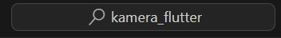

### Langkah 2: Tambah dependensi yang diperlukan

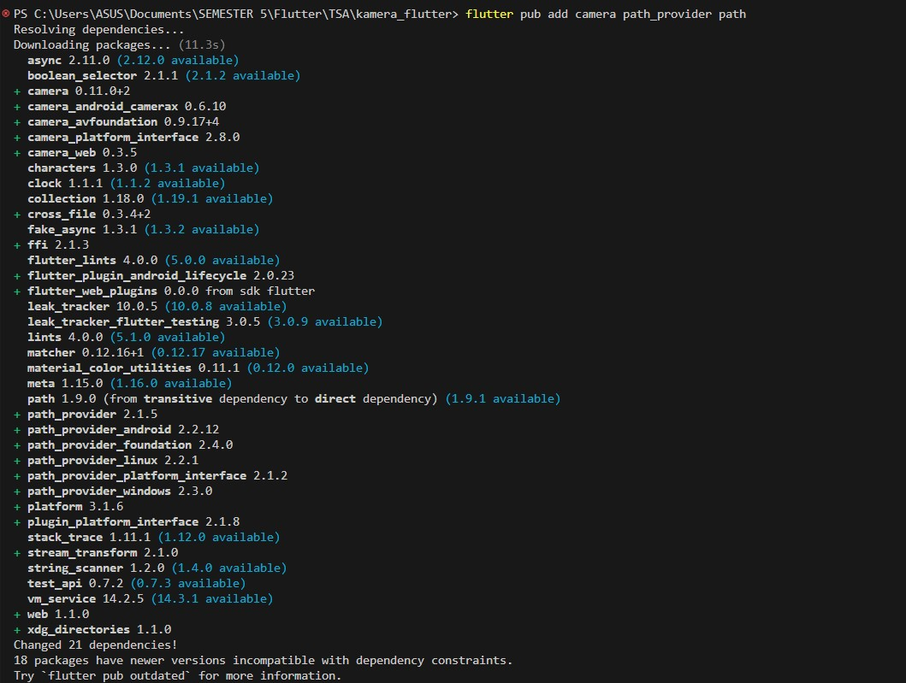

ios/Runner/Info.plist

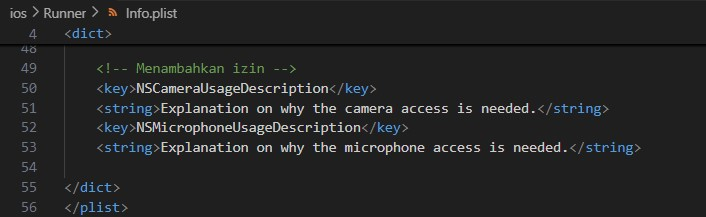

### Langkah 3: Ambil Sensor Kamera dari device

lib/main.dart

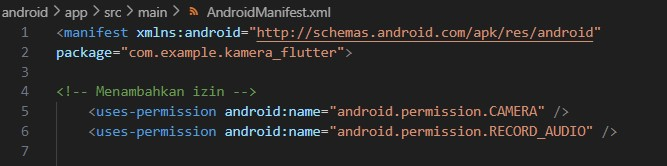

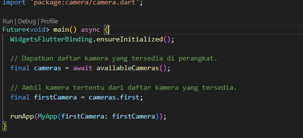

### Langkah 4: Buat dan inisialisasi CameraController

lib/widget/takepicture_screen.dart

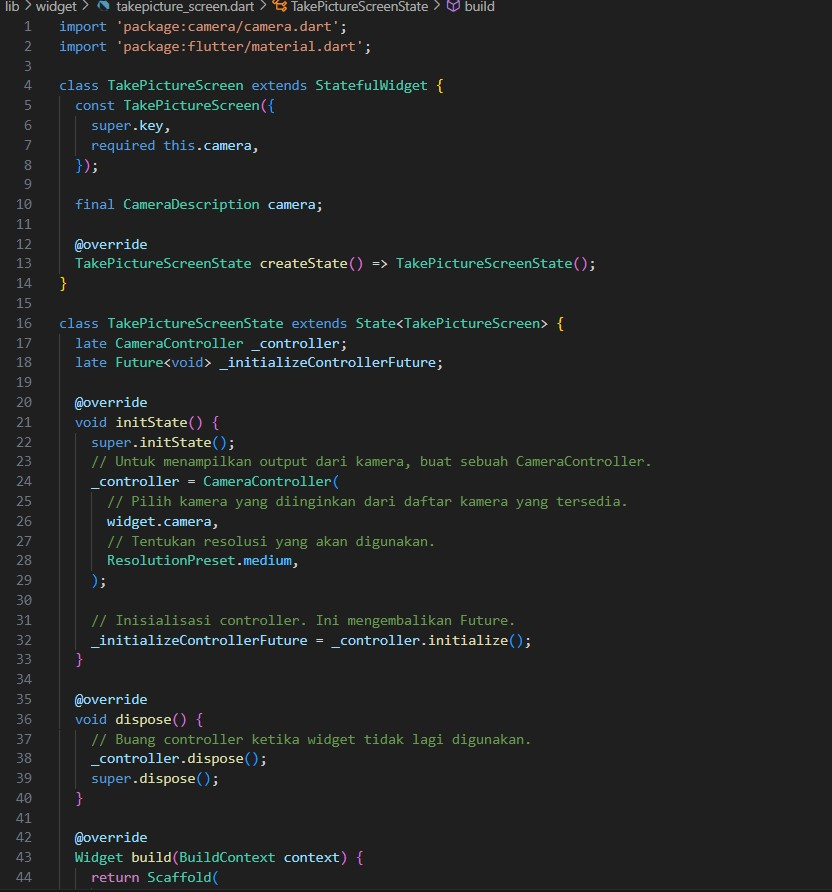

### Langkah 5: Gunakan CameraPreview untuk menampilkan preview foto

lib/widget/takepicture_screen.dart

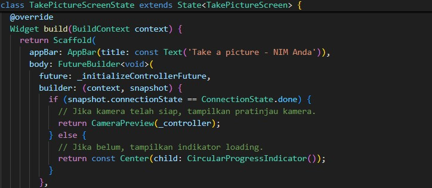

### Langkah 6: Ambil foto dengan CameraController

lib/widget/takepicture_screen.dart

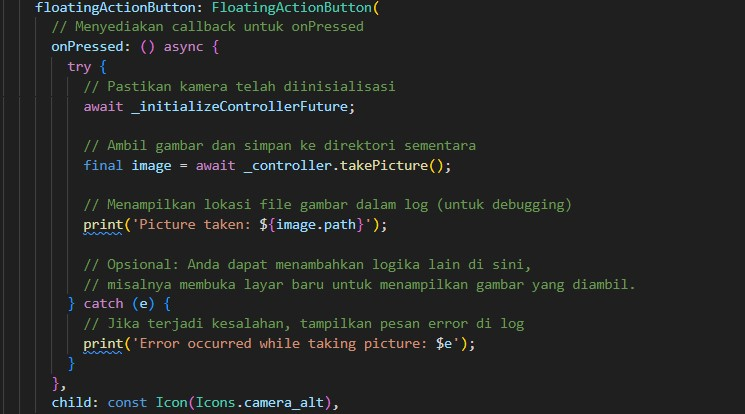

### Langkah 7: Buat widget baru DisplayPictureScreen

lib/widget/displaypicture_screen.dart

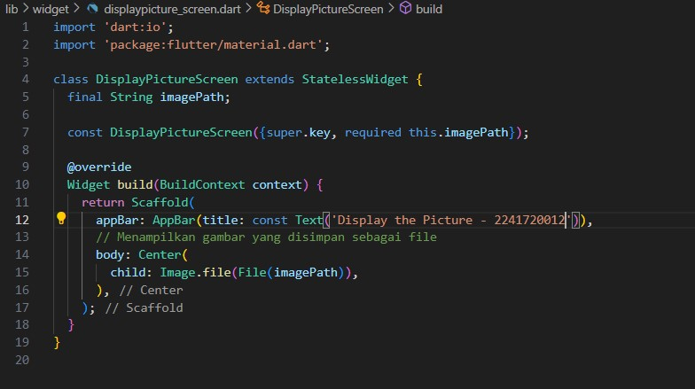

### Langkah 8: Edit main.dart

lib/main.dart

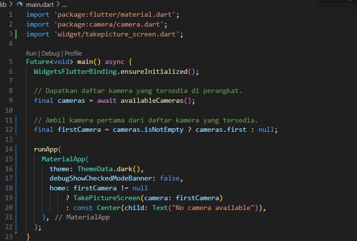

### Langkah 9: Menampilkan hasil foto

lib/widget/takepicture_screen.dart

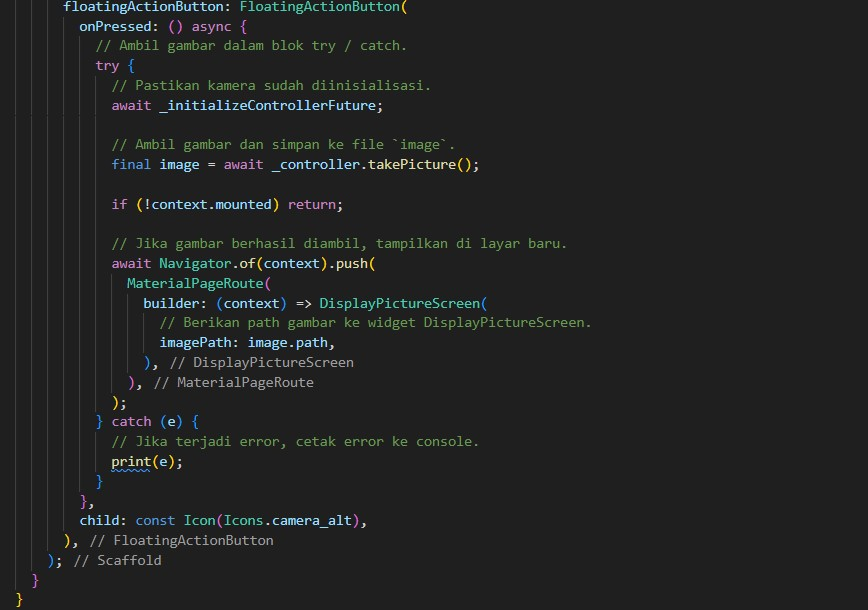
